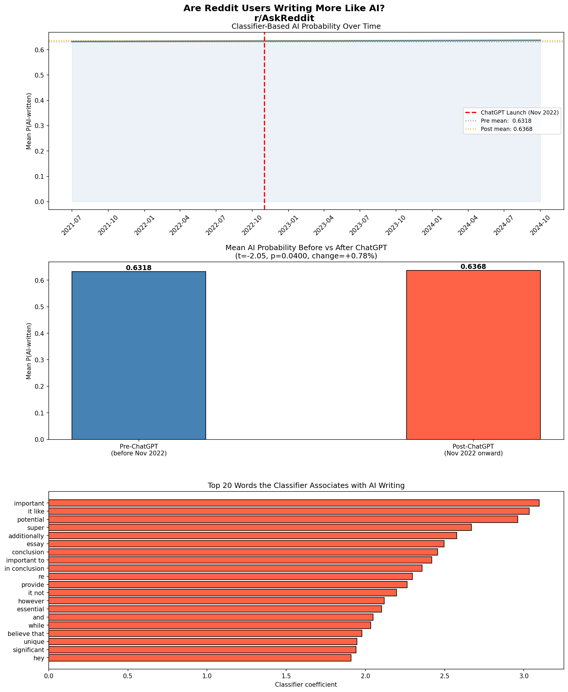
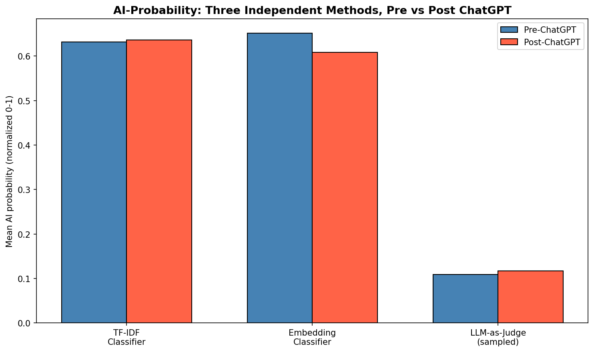
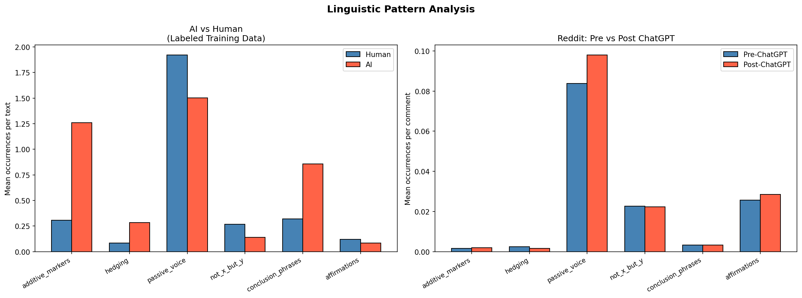
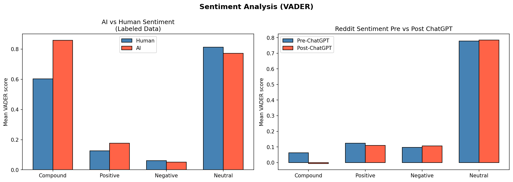

# AI-language-drift-proj
Did increased interactions with LLM's change how humans write? Testing whether r/AskReddit language became more AI-like post-2022 using three independent NLP methods (TF-IDF, embeddings, LLM-as-judge), with a bot-filtering robustness check and a live detection demo.

# Are We Writing Like AI? 

**Research question:** Has everyday online writing (r/AskReddit comments) become more AI-like since access to ChatGPT/Claude/Gemini was given to the general public in 2022?

This started as a linguistics final project and has been extended with modern NLP methods (sentence embeddings, LLM-as-judge) to cross-validate the original finding. Full methodology, results, and limitations below.

## TL;DR

Three independent methods tested whether Reddit writing became more "AI-like" after ChatGPT launched. Two agree, one disagrees, and the disagreement is explainable:

- **TF-IDF classifier** (98.85% accuracy) and an **LLM-as-judge** (Claude, no training on this task at all) both found a small but statistically significant *increase* in AI-probability post-ChatGPT
- A **sentence-embedding classifier** found the opposite, a larger *decrease*, but it's also 6 points less accurate and specifically worse at catching AI text, making it more likely to be picking up topic drift between the two sampled years than actual style change
- Specific AI writing patterns (hedging, "in conclusion," etc.) barely moved
- Sentiment moved in the **opposite** direction from AI text: Reddit got *more negative*, not more positive/polished, post-ChatGPT
- A robustness check confirmed the result isn't driven by bot-generated content (see Results below)

**Bottom line:** the evidence for AI-language adoption on Reddit is small and mixed, not a clean headline number. Being able to explain *why* three methods don't fully agree, rather than reporting only the one that "worked," is the actual finding here.

---

## Data

| Source | Size | Notes |
|---|---|---|
| r/AskReddit comments (Pushshift/Kaggle) | 22,844 comments | File 013 (2021) + File 017 (2024), streamed in batches due to 103GB total corpus size |
| AI vs. Human labeled text (Kaggle, Ragab et al. 2025) | 20,000 samples | Used to train classifiers |

## Methodology

1. **Classifier 1 (baseline):** TF-IDF (unigrams + bigrams) + Logistic Regression, trained on labeled data, applied to Reddit comments as a per-comment AI-probability score
2. **Classifier 2 (upgrade):** Sentence embeddings (`all-MiniLM-L6-v2`) + Logistic Regression, same task, to check whether the TF-IDF result holds under a modern representation
3. **LLM-as-judge (upgrade):** Claude scores a sampled subset directly, no training on this task, as a third independent signal
4. **Linguistic pattern analysis:** six regex-based markers of AI-typical writing (hedging, conclusion phrases, passive voice, etc.), validated first on labeled data, then tracked pre/post on Reddit
5. **Sentiment analysis:** VADER, on both labeled data (AI vs. human baseline) and Reddit (pre vs. post)
6. **Bot filtering (robustness check):** Reddit is known to have bot-generated content mixed into human posts, which would undermine using it as a "human baseline." Comments were flagged as likely-bot via four signals: bot self-disclosure phrases, bot-like usernames, the same author posting repeated/near-identical text in a short burst, and exact duplicate text appearing 3+ times across the corpus. The main result was then recomputed on the filtered data and compared against the original.

All comparisons use independent-samples t-tests, significance at p<0.05.

## Results

**Classifier performance:** 98.85% accuracy distinguishing AI from human text on held-out labeled data (TF-IDF baseline).



**Main finding — AI probability, pre vs post ChatGPT:**

| Method | Pre-ChatGPT | Post-ChatGPT | Change | p-value | Classifier accuracy |
|---|---|---|---|---|---|
| TF-IDF classifier | 0.6324 | 0.6371 | +0.74% | 0.0439 | 98.85% |
| Embedding classifier (`all-MiniLM-L6-v2`) | 0.6517 | 0.6087 | −6.60% | <0.000001 | 92.85% |
| LLM-as-judge (Claude, n=200/group sampled) | 10.45/100 | 11.87/100 | +13.6% (relative) | 0.0490 | n/a (untrained) |

**These three methods don't fully agree, and that disagreement is itself part of the finding.**

TF-IDF and the LLM-judge, two methods with no shared training data or approach, both detect a small but significant *increase* in AI-likelihood post-ChatGPT. The embedding classifier detects a much larger, highly significant *decrease*.

The most likely explanation isn't that the embedding classifier found a "truer" signal, it's a weaker classifier for this specific task. Its accuracy on held-out labeled data is 6 points lower than TF-IDF's (92.85% vs 98.85%), and its recall on AI-labeled text specifically is notably worse (0.88 vs 0.96 for human text), meaning it misses real AI text more often. TF-IDF directly counts the exact lexical markers known to signal AI writing ("additionally," "in conclusion," etc.); sentence embeddings compress a passage into a general semantic vector, which can wash out those specific word-choice signals in favor of topic and meaning. Given the two Reddit files sampled are 3 years apart, the embedding classifier's result is more plausibly explained by **topic drift** (different discourse, different events) between 2021 and 2024 Reddit than by a genuine shift in AI-influenced writing style.

**Bottom line:** the two higher-confidence, more style-sensitive methods agree on a small increase. The disagreeing method has a specific, stated reason to weight it less rather than being dismissed without explanation.



*(see `notebooks/tier1_embeddings_and_llm_judge.py` for full methodology)*

**Robustness check — does bot content explain the result?**

A common critique of using Reddit as a "human baseline" is that it's flooded with bot posts. To test this directly, comments were flagged as likely-bot (4.1% of the corpus, 937 of 22,844) using self-disclosure phrases, bot-like usernames, and repeated/duplicate text patterns, then the main result was recomputed with those comments removed:

| | Pre-ChatGPT | Post-ChatGPT | Change | p-value |
|---|---|---|---|---|
| With bot-flagged comments (original) | 0.6318 | 0.6368 | +0.78% | 0.0400 |
| With likely bots removed | 0.6324 | 0.6371 | +0.74% | 0.0439 |

The result barely moves and stays significant either way. The small AI-probability shift is **not** an artifact of bot content in the "human" baseline.

**Linguistic patterns:** only passive voice changed significantly pre/post (and it *decreased*, the opposite of the AI-adoption hypothesis). All other markers (hedging, conclusion phrases, additive markers) showed no significant change.



**Sentiment:** Reddit got measurably *more negative* post-ChatGPT (compound sentiment −100.9%, p<0.0001) — moving *away* from AI text's characteristic positivity, not toward it.



See [corpus statistics](outputs/05_corpus_statistics.png) for word count and question rate, both essentially flat pre/post.

## Limitations

- Classifier trained on formal essays may not transfer perfectly to casual Reddit text
- The two Reddit files sampled are 3 years apart — confounds beyond ChatGPT exist (platform changes, community drift, etc.)
- Some post-2022 comments may themselves be AI-generated, which would inflate the "AI-like" score independent of human writing style change
- 22k comments limits statistical power for fine-grained pattern-level analysis
- VADER is rule-based and can mislabel sarcasm/irony, common on Reddit
- Bot filtering uses heuristics (self-disclosure phrases, usernames, repeated/burst text), not a verified ground-truth bot list, so some bots likely remain undetected and a small number of genuine users may have been flagged. The check showed the main result is robust to this either way (see above), but the filter is not exhaustive

**Addressing prior feedback:** an earlier reviewer of this project flagged that Reddit is known to have bot-generated content, raising a fair concern about whether it's a clean "human baseline." Rather than switch data sources, this was tested directly with the bot-filtering robustness check above — the result held up.

## Why the mixed result matters more than a clean one would

A single significant p-value from one classifier is easy to overclaim. Running the same question through three independent methods, and being upfront when they don't fully agree, is a more honest and more useful result than a tidy headline number. That tension (small but real classifier signal vs. no corroborating shift in actual writing style or tone) is the interesting part of this project.

## Live demo

`app/streamlit_app.py` — paste any text and get a live AI-probability read from the LLM-as-judge method. Run locally:

```bash
pip install -r requirements.txt
export ANTHROPIC_API_KEY=your_key_here
streamlit run app/streamlit_app.py
```

## Repo structure

```
├── notebooks/
│   ├── ask-reddit-analysis-final.ipynb    # full pipeline: classifier, bot filtering, patterns, sentiment, Tier 1 methods — with real outputs
│   └── tier1_embeddings_and_llm_judge.py  # Tier 1 cells as standalone reference
├── app/
│   └── streamlit_app.py                  # live demo
├── outputs/                              # saved charts + monthly_scores.csv
├── requirements.txt
└── README.md
```

## Reference

Ragab et al. (2025). *Alexandria Engineering Journal*, 126, 116–130.

---

*Originally a final project for LIN 127 (Computational Linguistics), UC Davis. Extended independently.*
